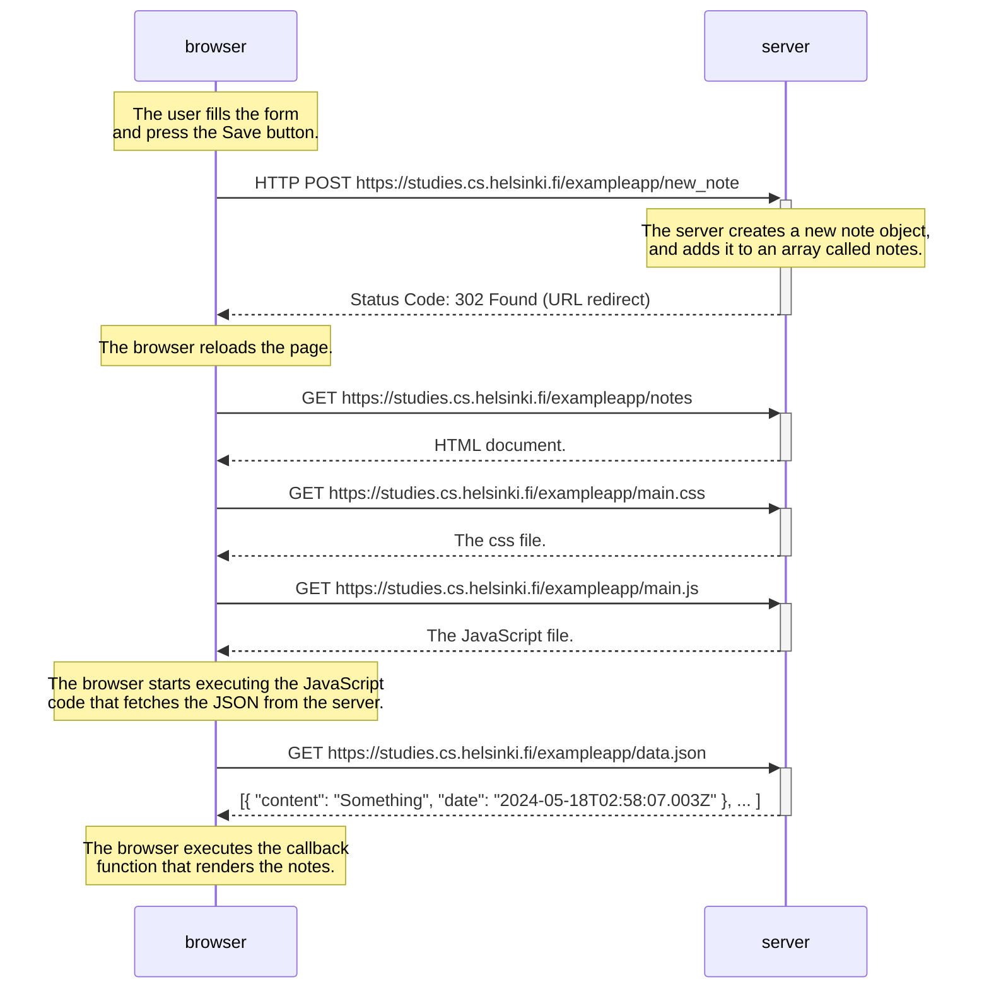

```mermaid
    sequenceDiagram
        participant browser
        participant server

        Note over browser: The user fills the form <br/>and press the Save button.
        
        %% new_note
        browser->>+server: HTTP POST https://studies.cs.helsinki.fi/exampleapp/new_note
        Note over server: The server creates a new note object, <br/>and adds it to an array called notes.
        server-->>-browser: Status Code: 302 Found (URL redirect)
        Note over browser: The browser reloads the page.

        %% notes
        browser->>+server: GET https://studies.cs.helsinki.fi/exampleapp/notes
        server-->>-browser: HTML document.

        %% main.css
        browser->>+server: GET https://studies.cs.helsinki.fi/exampleapp/main.css
        server-->>-browser: The css file.

        %% main.js
        browser->>+server: GET https://studies.cs.helsinki.fi/exampleapp/main.js
        server-->>-browser: The JavaScript file.
        Note over browser: The browser starts executing the JavaScript <br/> code that fetches the JSON from the server.

        %% data.json
        browser->>+server: GET https://studies.cs.helsinki.fi/exampleapp/data.json
        server-->>-browser: [{ "content": "Something", "date": "2024-05-18T02:58:07.003Z" }, ... ]
        Note over browser: The browser executes the callback <br/> function that renders the notes.
```
