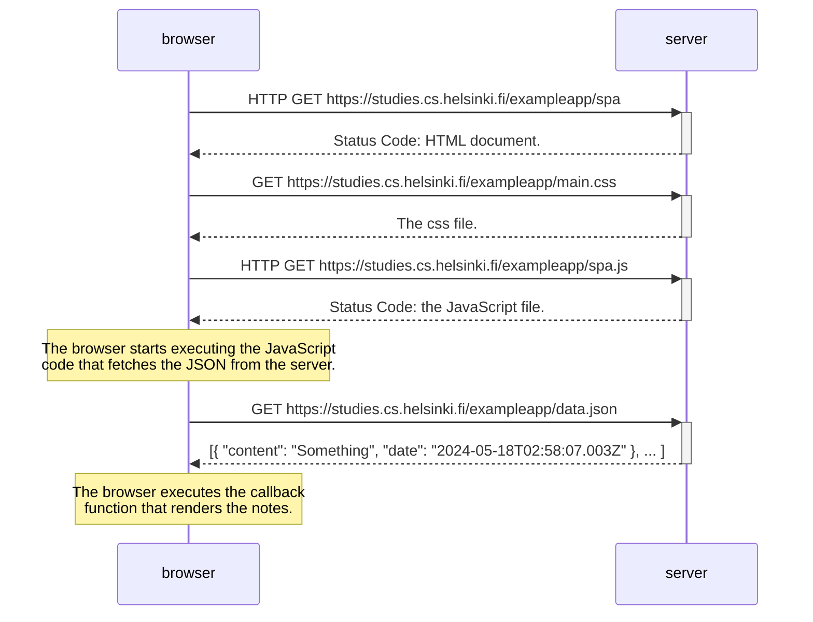

```mermaid
    sequenceDiagram
        participant browser
        participant server

        %% spa
        browser->>+server: HTTP GET https://studies.cs.helsinki.fi/exampleapp/spa
        server-->>-browser: Status Code: HTML document.

        %% main.css
        browser->>+server: GET https://studies.cs.helsinki.fi/exampleapp/main.css
        server-->>-browser: The css file.

        %% spa.js
        browser->>+server: HTTP GET https://studies.cs.helsinki.fi/exampleapp/spa.js
        server-->>-browser: Status Code: the JavaScript file.
        Note over browser: The browser starts executing the JavaScript <br/> code that fetches the JSON from the server.
        
        %% data.json
        browser->>+server: GET https://studies.cs.helsinki.fi/exampleapp/data.json
        server-->>-browser: [{ "content": "Something", "date": "2024-05-18T02:58:07.003Z" }, ... ]
        Note over browser: The browser executes the callback <br/> function that renders the notes.
```
