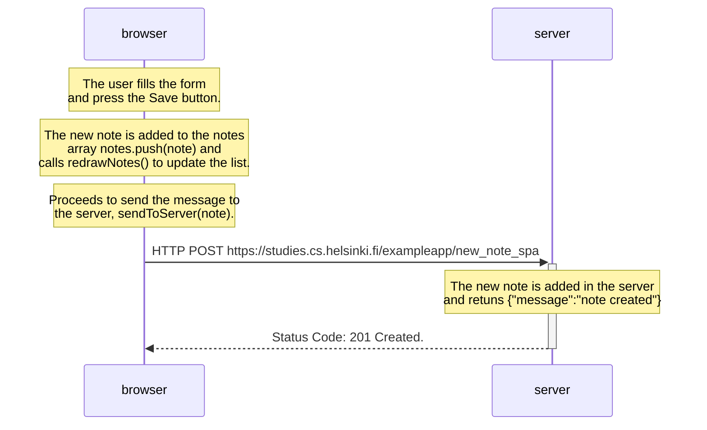

```mermaid
    sequenceDiagram
        participant browser
        participant server

        Note over browser: The user fills the form <br/>and press the Save button.
        Note over browser: The new note is added to the notes<br/> array notes.push(note) and <br/>calls redrawNotes() to update the list.
        Note over browser: Proceeds to send the message to<br/> the server, sendToServer(note).
        
        %% spa
        browser->>+server: HTTP POST https://studies.cs.helsinki.fi/exampleapp/new_note_spa
        Note over server: The new note is added in the server <br/>and retuns {"message":"note created"}
        server-->>-browser: Status Code: 201 Created.
```