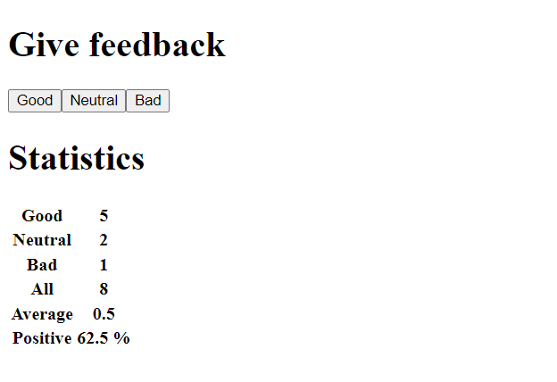

# unicafe

An application for collectin custumer feedback. There are only three options for feedback: good, neutral, and bad.
Shows statistics like number of votes, average score and positive percentage.

Exercises from https://fullstackopen.com/en/part1/a_more_complex_state_debugging_react_apps#exercises-1-6-1-14
1.6 - 1.11

## Installation and Setup Instructions

Installation:

`npm install`  

To Start:

`npm run dev`  
