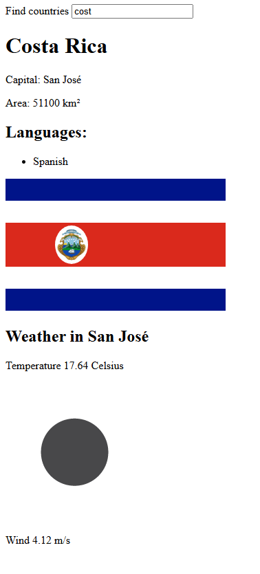

# countries

An application where you can search for countries and see some information like their capitals or the weather.
The weather information is obtain from https://openweathermap.org/, so an API key will be necesary for this application to work as expected.

Exercises from https://fullstackopen.com/en/part2/
2.18 - 2.20

## Installation and Setup Instructions

Installation:

`npm install`  

To Start:

To run the application:
`($env:VITE_SOME_KEY="[your weather api key here]") -and (npm run dev)`

This will run but you wont be able to get weather information:
`npm run dev`
